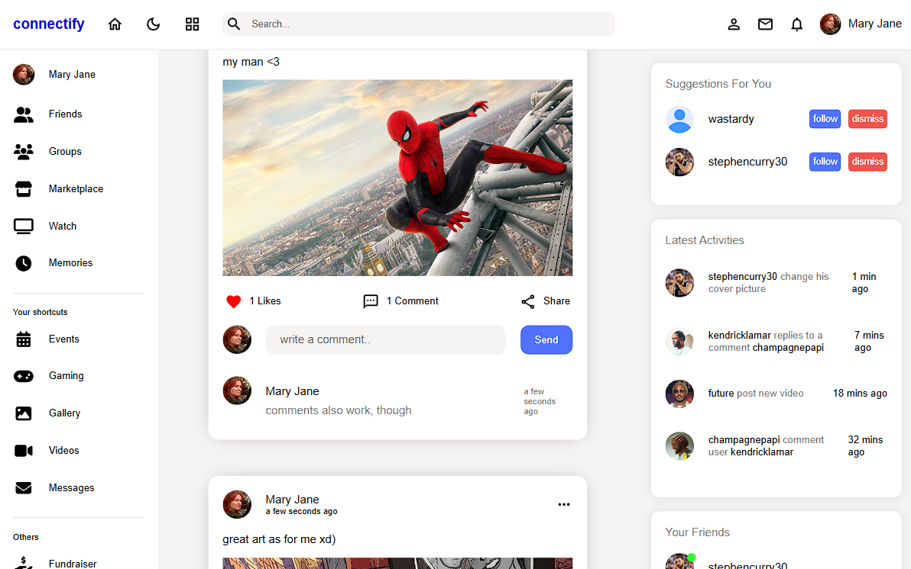
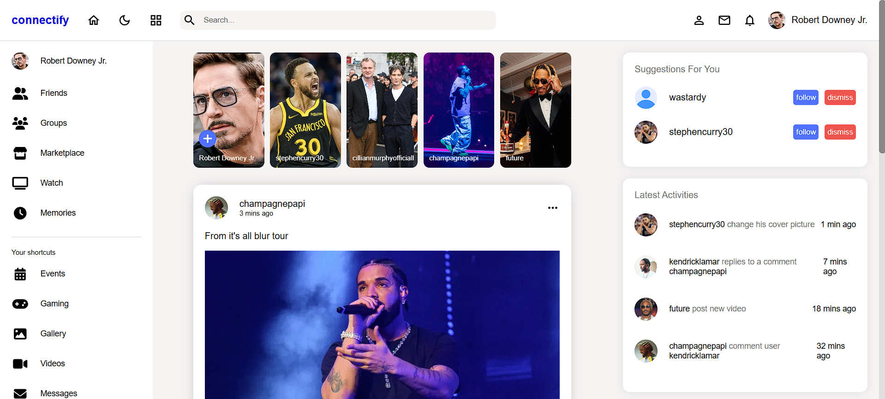
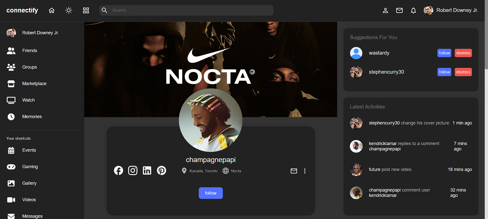
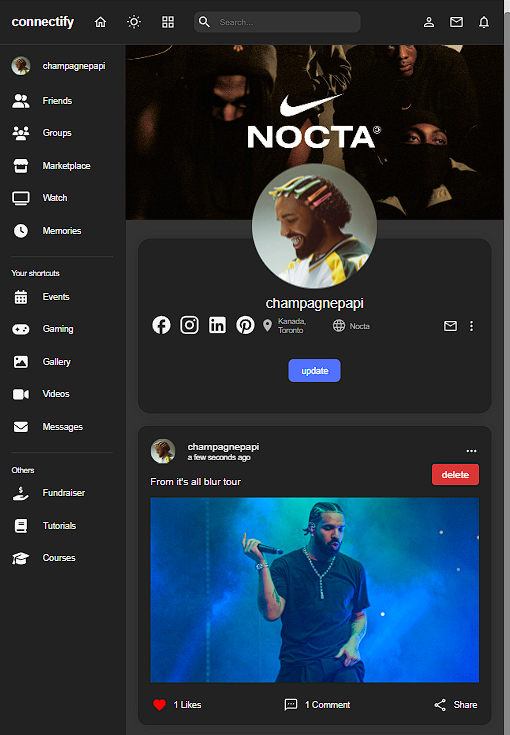
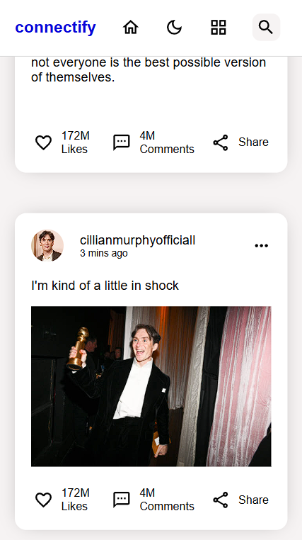
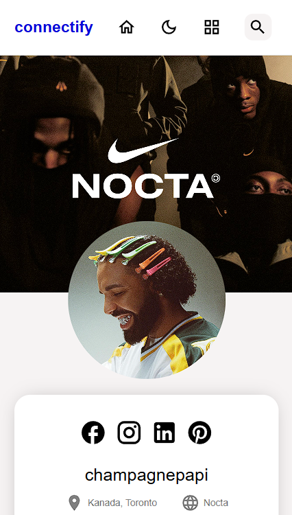
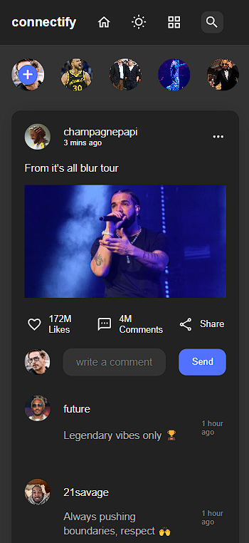

# ➡️ connectify social media 
## **react and backend practice**

> React social media app design, dark / light modes & responsive design

## 1.1. PC home page


> -



## 1.2. PC profile + dark mode


## 2.1. iPad profile + comments section


## 3.1. mobile



## 3.2. mobile + dark mode


## Usage

This website is built with [Vite](https://vite.dev/) + [React](https://react.dev/) and [Sass](https://sass-lang.com/). It uses [Font Awesome](https://fontawesome.com/) and [Material Icons](https://mui.com/material-ui/material-icons/?theme=Outlined) for icons.

In order to customize this website, you need to install [Node.js](https://nodejs.org/en/) **OR** [Yarn](https://yarnpkg.com/). 
> **Note**: Use either `npm` or `yarn` throughout the process. Mixing the two may cause dependency conflicts.Then, clone this repository and run:

```bash
npm install
# or
yarn install 
```

This will install Vite, React, Bootstrap, Sass and Font Awesome. 

> To build the site for production:

```bash
npm start
# or
yarn start
```